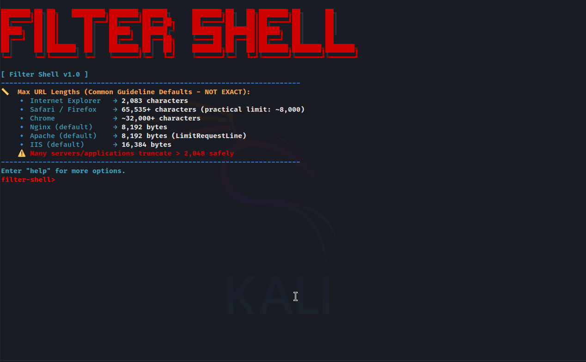

# Filter Shell

**Filter Shell** is a wrapper CLI tool built on top of [php_filter_chain_generator](https://github.com/synacktiv/php_filter_chain_generator) by Synacktiv. It exploits Local File Inclusion (LFI) vulnerabilities via PHP filter chaining to execute commands remotely without requiring file uploads. See [LFI2RCE via PHP Filters](https://book.hacktricks.wiki/en/pentesting-web/file-inclusion/lfi2rce-via-php-filters.html).



---

## Features

- Interactive shell interface for command execution through LFI vulnerabilities
- Automatic cloning of the underlying `php_filter_chain_generator` tool if not present
- Supports command checking with URL length estimation
- Remote OS detection (Linux/Windows)
- Basic help and usability commands

---

## Prerequisites

- Ruby (tested on Ruby 2.7+)
- Python 3
- Command-line tools: `curl`, `git`, `grep`, `xargs` (usually pre-installed on Linux/macOS)
- Internet connection for cloning the dependency repository

---

## Installation

1. **Clone or download this repository:**

```bash
git clone https://github.com/yourusername/filter-shell.git
cd filter-shell
```

## Usage
```bash
ruby filter_shell.rb 'http://TARGET:PORT/PATH?PARAM='
```
